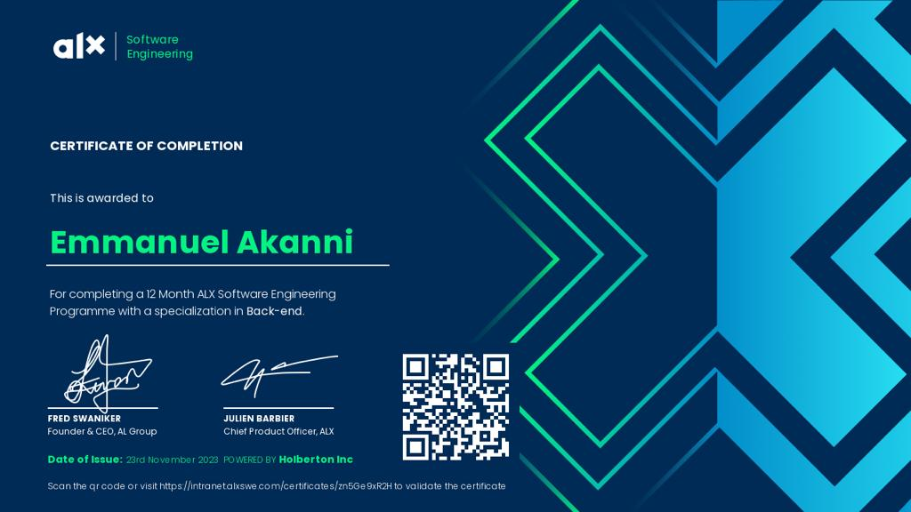

- 👋 Hi, I’m @coderoyalty
- 👀 I’m interested in anything computer, programming, development and engineering.
- 🌱 I’m currently learning ...
- 💞️ I’m looking to collaborate on ...
- 📫 How to reach me akanniemmanuel33@gmail.com
- I write articles here: https://techroyal.hashnode.dev/
- My FreeCodeCamp Backend Development Certification - https://www.freecodecamp.org/certification/coderoyalty/back-end-development-and-apis
- Practice Software Engineering at ALX - 2022 - 2023

### My Tech Stack
- JavaScript, TypeScript, Python, SQL

<!---
coderoyalty/coderoyalty is a ✨ special ✨ repository because its `README.md` (this file) appears on your GitHub profile.
You can click the Preview link to take a look at your changes.
--->

<!---

--->

